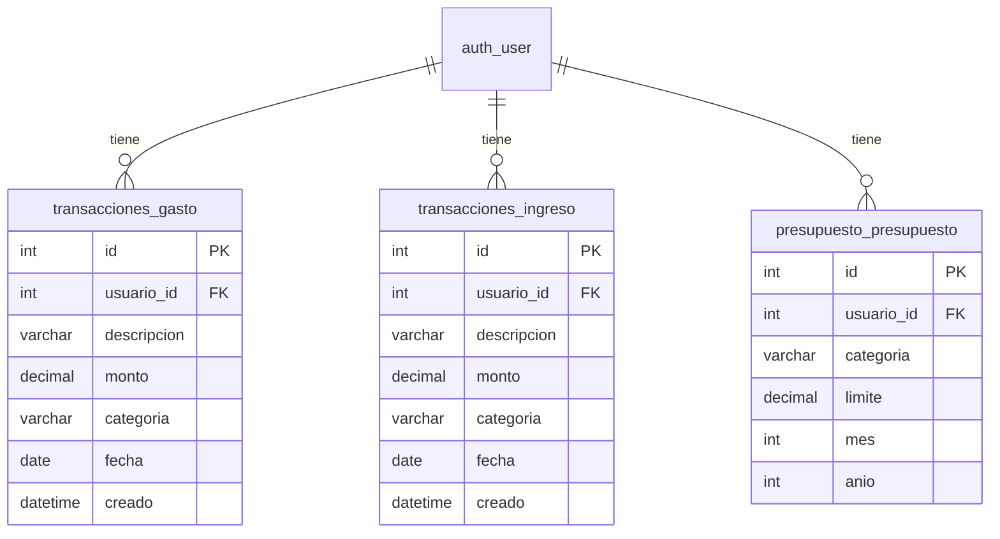

# Diagrama de la Base de Datos — FinTrack

## Notas

- `categoria` en los 3 modelos es un `CharField` con opciones definidas en `transacciones/choices.py`
- `presupuesto_presupuesto` tiene una constraint `UNIQUE(usuario, categoria, mes, anio)`
- No hay modelos en `usuarios`, `dashboard` ni `chatbot`
- Se usa el `User` built-in de Django (`auth_user`)
